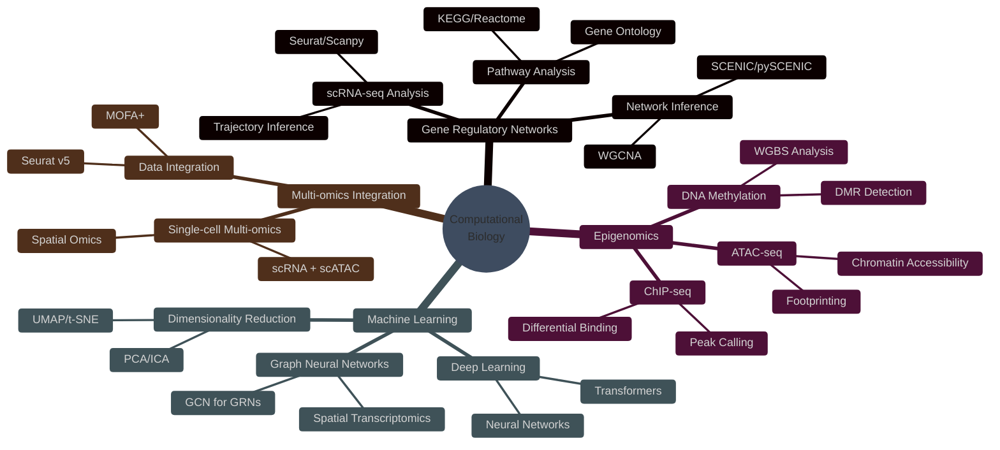
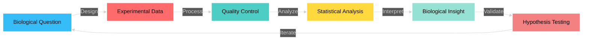

<div align="center">

<!-- Header with wave animation -->


</div>

<div align="center">

### 💭 *"Many unexpected results are due to artifacts or technical errors, but in some cases is not and they hide important information. The best thing about our job is to understand when this happens. A job similar to that of a detective."* 
### **Do not forget.**

<br>

[](https://git.io/typing-svg)

<br>


[](https://github.com/ngsfc)
[](https://github.com/ngsfc)

</div>

---

## 🧬 About Me


```r
bioinformatician <- list(
  name = "Francesco Cecere",
  role = "Computational Biologist",
  location = "🇮🇹 Italy",
  focus = c("Gene Regulatory Networks", 
            "Single-cell Analysis",
            "Epigenomics"),
  languages = c("R", "Python", "Bash"),
  passion = "Unraveling biological mysteries 🔬"
)

print(paste("Current mission:", 
            bioinformatician$passion))
```

<br>

### 🎯 What I Do

🔬 **Research Focus:** Applying Gene Regulatory Network (GRN) inference to single-cell RNA sequencing data  
🧪 **Expertise:** Computational Genomics, Epigenomics & Multi-omics Integration  
🎨 **Approach:** Combining statistical rigor with biological intuition  
🌱 **Currently Learning:** Advanced ML/DL methods for biological data interpretation  
💡 **Mission:** Bridge computational innovation with biological discovery  
🤝 **Open to:** Collaborations in computational biology projects  

<br clear="right"/>

---

## 🛠️ Tech Stack & Expertise

<div align="center">

### 💻 Core Programming Languages


### 🧬 Bioinformatics & Data Science


### 📊 Data Analysis & Visualization


### 🔧 DevOps & Workflow Management


</div>

---

## 🔬 Research Interests & Workflow

<div align="center">



</div>

---

## 📊 GitHub Analytics

<div align="center">
  
### 📈 Performance Metrics

<a href="https://github.com/ngsfc">
  
</a>
<a href="https://github.com/ngsfc">
  
</a>

</div>

<div align="center">
  
### 🔥 Contribution Streak

<a href="https://github.com/ngsfc">
  
</a>

</div>

<div align="center">
  
### 📊 Contribution Activity

<a href="https://github.com/ngsfc">
  
</a>

</div>

<div align="center">

### 🏆 Profile Summary

<a href="https://github.com/ngsfc">
  
</a>

</div>

---

## 🏆 GitHub Achievements

<div align="center">
  
<a href="https://github.com/ngsfc">
  
</a>

</div>

---

## 🎯 Featured Projects

<div align="center">

<a href="https://github.com/ngsfc">
  
</a>

<!-- Add more pinned repositories as needed -->

</div>

---

## 💡 Skills Proficiency

<div align="center">

| Skill Category | Technologies | Proficiency |
|:---:|:---:|:---:|
| **Single-cell Analysis** | Seurat, Scanpy, Cell Ranger |  |
| **R Programming** | Tidyverse, Bioconductor, Shiny |  |
| **Python** | Pandas, NumPy, Scikit-learn |  |
| **Genomics** | RNA-seq, ChIP-seq, ATAC-seq |  |
| **Data Visualization** | ggplot2, Plotly, Seaborn |  |
| **Machine Learning** | Classification, Clustering, DL |  |
| **Workflow Management** | Snakemake, Nextflow, Docker |  |

</div>

---

## 📚 Recent Activity

<!--START_SECTION:activity-->
<!-- This section will be automatically updated with GitHub Actions -->
<!--END_SECTION:activity-->

---

## 🎓 Research Philosophy

<div align="center">



</div>

<div align="center">

### 🔍 Core Principles

| Principle | Description |
|:---------:|:------------|
| 🎯 **Reproducibility** | All analyses documented with version control |
| 📊 **Statistical Rigor** | Proper experimental design and hypothesis testing |
| 🔬 **Biological Validation** | Computational predictions meet experimental reality |
| 🤝 **Collaboration** | Bridge wet-lab and dry-lab expertise |
| 📖 **Open Science** | Share methods, code, and insights with the community |

</div>

---

## 📫 Connect With Me

<div align="center">

<a href="mailto:francesco.cecerengs@gmail.com">
  
</a>
<a href="https://linkedin.com/in/francesco-cecere-ngs">
  
</a>
<a href="https://x.com/FcecereNGS">
  
</a>
<a href="https://www.researchgate.net/profile/Francesco-Cecere-2">
  
</a>
<a href="https://github.com/ngsfc">
  
</a>

<br><br>

### 💬 Let's Collaborate!

I'm always interested in discussing:
- 🧬 Novel approaches to single-cell analysis
- 🕸️ Gene regulatory network inference methods
- 🤖 Machine learning applications in genomics
- 📊 Data visualization best practices
- 🔬 Open source bioinformatics tools

**Feel free to reach out for collaborations or just to chat about computational biology!**

</div>

---

## 📊 Detailed Statistics

<details>
<summary>🔍 Click to expand detailed GitHub metrics</summary>
<br>

<div align="center">

### 📅 Commit Patterns


### 🎯 Language Usage Over Time


### ⏰ Commit Time Distribution


</div>

</details>

---

## 🙏 Acknowledgments & Credits

<div align="center">

- 🎨 **Chromatin Remodeling GIF:** [Coding Animation](https://dribbble.com/shots/4171367) by [Glebich](https://dribbble.com/glebich)
- 🛡️ **Badges & Icons:** [Shields.io](https://shields.io/)
- 📊 **GitHub Stats:** [GitHub Readme Stats](https://github.com/anuraghazra/github-readme-stats)
- 🏆 **Trophies:** [GitHub Profile Trophy](https://github.com/ryo-ma/github-profile-trophy)
- 📈 **Activity Graph:** [GitHub Readme Activity Graph](https://github.com/Ashutosh00710/github-readme-activity-graph)
- ✨ **Typing Animation:** [Readme Typing SVG](https://github.com/DenverCoder1/readme-typing-svg)
- 🔥 **Streak Stats:** [GitHub Readme Streak Stats](https://github.com/DenverCoder1/github-readme-streak-stats)
- 📋 **Summary Cards:** [GitHub Profile Summary Cards](https://github.com/vn7n24fzkq/github-profile-summary-cards)

</div>

---

<div align="center">

### ⚡ Fun Facts

```r
fun_facts <- c(
  "🔬 I debug code like I hunt for SNPs: methodically",
  "📊 My favorite plot is a well-annotated UMAP",
  "🧬 I dream in gene ontology terms",
  "☕ Coffee is my rate-limiting step",
  "🎯 Edge case enthusiast"
)

sample(fun_facts, 1)
```

</div>

---

<div align="center">

<!-- Snake animation -->


</div>

---

<div align="center">

### 📈 Visitor Count Timeline


</div>

---

<div align="center">

<!-- Footer wave animation -->


</div>

---

<div align="center">

### ⭐ Show Your Support

If you find my work interesting or useful, please consider giving a ⭐ to my repositories!

<br>

***Made with ❤️ and R by [Francesco Cecere](https://github.com/ngsfc)***

*"In data we trust, but we always validate." - Bioinformatician's Motto*

</div>
