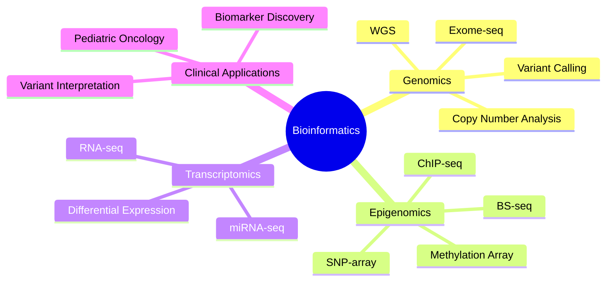

# 🧬 Hello, I'm Francesco!

### 💭 *"Many unexpected results are due to artifacts or technical errors, but in some cases is not and they hide important information. The best thing about our job is to understand when this happens. A job similar to that of a detective. **Do not forget.**"*

 

<a href="#-about-me">About</a> •
<a href="#-research-focus">Research</a> •
<a href="#️-tech-stack--tools">Tech Stack</a> •
<a href="#-github-analytics">Stats</a> •
<a href="#-lets-connect">Contact</a>

---

  

---

## 🩺 About Me

- 🔬 **Senior Bioinformatic Researcher** at **AORN Santobono-Pausilipon**, a leading pediatric hospital in Naples, Italy
- 🧫 I work at the intersection of **clinical genomics** and **computational biology**, turning NGS data from pediatric oncology patients into actionable biological insight
- 🧠 I design and maintain analysis pipelines spanning **DNA, RNA, and epigenome** sequencing data
- 🌱 Currently deepening my work on **variant interpretation**, **methylation profiling**, and **reproducible bioinformatics workflows**
- 🤝 Open to collaborations in computational biology, cancer genomics, and pipeline development

---

## 🔬 Research Focus

---

## 🛠️ Tech Stack & Tools

### 💻 Programming Languages

  
  
  
  

### 🧬 NGS & Variant Analysis

  
  
  
  
  
  
  

### 📊 R / Bioconductor Ecosystem

  
  
  
  
  
  

### 🔧 DevOps & Infrastructure

  
  
  
  
  

---

## 📈 GitHub Analytics

  
  

  

  

---

## 🏆 GitHub Trophies

  

---

## 📫 Let's Connect!

---

## 🙏 Acknowledgments

- Icons and badges: [Shields.io](https://shields.io/)
- GitHub Stats: [GitHub Readme Stats](https://github.com/anuraghazra/github-readme-stats)

---

  

---

  <i>⭐ From <a href="https://github.com/ngsfc">ngsfc</a> - Feel free to reach out for collaborations in computational biology!</i>

