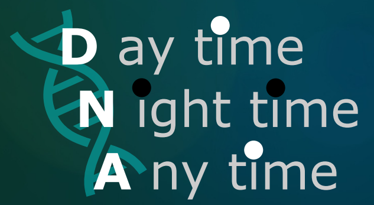

  
# 👋 Hello, I'm Francesco!

### 💭 *"Many unexpected results are due to artifacts or technical errors, but in some cases is not and they hide important information. The best thing about our job is to understand when this happens. A job similar to that of a detective. **Do not forget.**"* 
###

---

---

## 🛠️ Tech Stack & Tools

### 💻 Programming Languages

  
  
  

### 🔧 DevOps & Tools

  
  
  

---

## 📈 GitHub Analytics

  
  

  

  

---

## 🏆 GitHub Trophies

  

---

## 📫 Let's Connect!

  

---

## 🙏 Acknowledgments

- Icons and badges: [Shields.io](https://shields.io/)
- GitHub Stats: [GitHub Readme Stats](https://github.com/anuraghazra/github-readme-stats)

---

  

---

  <i>⭐ From <a href="https://github.com/ngsfc">ngsfc</a> - Feel free to reach out for collaborations in computational biology!</i>

